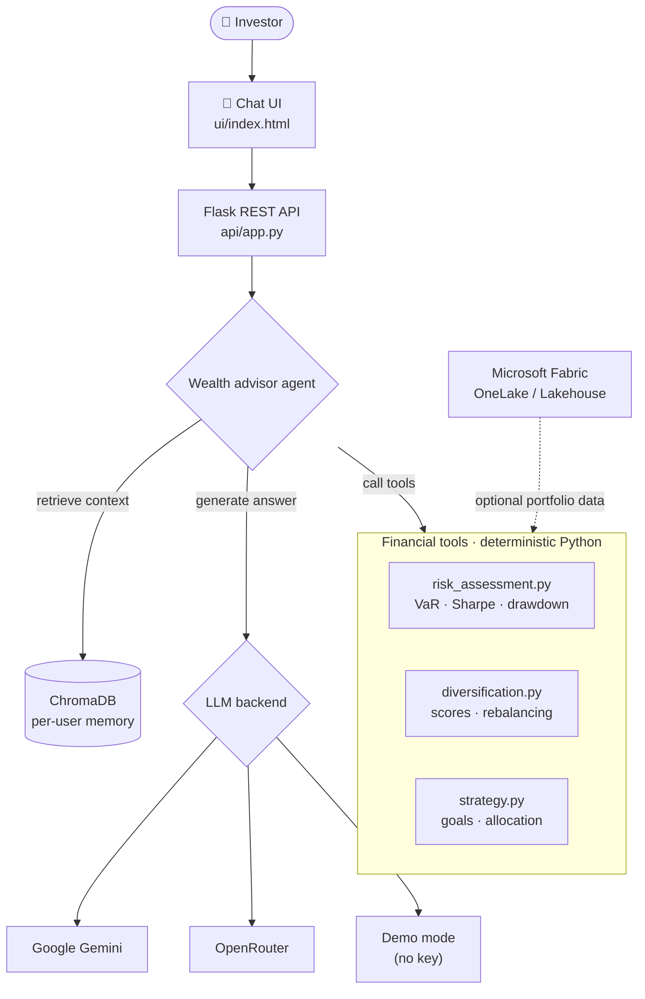

<div align="center">


# AI Financial Advisor Chatbot — Portfolio Risk Analysis with LLM Agents, RAG & LangChain

**Ask a question in plain English, get real numbers back: Value at Risk, Sharpe ratio, max drawdown, diversification score and a goal-based investment plan — explained by an LLM that remembers you.**

<p>
  
  
  
  
  
  
  
</p>

[Features](#-features) · [Architecture](#-architecture) · [Quick start](#-quick-start) · [API](#-rest-api) · [Structure](#-project-structure)

</div>

---

**AI Wealth Advisor** is a **conversational financial assistant** that analyzes investment portfolios, assesses risk and designs investment strategies. It's a **hybrid RAG system**: an LLM generates the answers, **deterministic Python tools** do the math (so the numbers are calculated, not hallucinated), and a **ChromaDB vector store** gives every user persistent conversational memory.

It runs on **Google Gemini** or **OpenRouter** out of the box — and falls back to a **demo mode with no API key at all**, so anyone can try it in under a minute.

## ✨ Features

| | Feature | What you get |
|---|---|---|
| 📉 | **Portfolio risk assessment** | VaR at 95% and 99%, Sharpe ratio, Sortino ratio, volatility, max drawdown, beta |
| 🧩 | **Diversification analysis** | 0–100 scores across sector, geography and asset class, concentration risk, rebalancing suggestions |
| 🎯 | **Investment strategy design** | Risk-tolerance questionnaire → recommended allocation, monthly savings needed, projected value, action items |
| 🧠 | **Conversational memory** | ChromaDB stores preferences, portfolio and history per user for personalized follow-ups |
| 🔌 | **Model-agnostic LLM layer** | Gemini, OpenRouter (free models supported), OpenAI via LangChain — or keyless demo mode |
| 🏢 | **Microsoft Fabric connector** | Template OneLake / Lakehouse client for pulling portfolio data from an enterprise data lake |
| 💬 | **Chat UI** | Browser chat interface served straight from the Flask app |

## 🏗️ Architecture



**Why this design:** LLMs are bad at arithmetic and great at explanation. The agent routes every quantitative question to a tool that returns structured results, then uses the model only to explain them in context — retrieval supplies the user's history, tools supply the facts, generation supplies the conversation.

## ⚡ Quick start

```bash
git clone https://github.com/intikhab49/ai-wealth-advisor.git
cd ai-wealth-advisor

pip install -r requirements.txt

cp .env.example .env     # add a key — or skip this and use demo mode
python api/app.py
```

Open **http://localhost:5000** and start chatting.

### Environment variables

| Variable | Purpose |
|---|---|
| `GOOGLE_API_KEY` | Google Gemini — free key at [aistudio.google.com](https://aistudio.google.com/apikey) |
| `OPENROUTER_API_KEY` | OpenRouter — access to free and paid models |
| `OPENROUTER_MODEL` | Model slug to use through OpenRouter |
| `OPENAI_API_KEY` | OpenAI (optional, LangChain chains) |
| `AZURE_TENANT_ID` · `AZURE_CLIENT_ID` · `FABRIC_WORKSPACE_ID` · `FABRIC_LAKEHOUSE_NAME` | Optional Microsoft Fabric connection |

> [!TIP]
> No key set? The app starts a demo agent automatically, so the UI and all financial tools still work.

## 📡 REST API

| Method | Endpoint | Description |
|---|---|---|
| GET | `/api/health` | Health check |
| POST | `/api/chat` | Chat with the advisor (memory-aware) |
| POST | `/api/risk-assessment` | Portfolio risk metrics |
| POST | `/api/diversification` | Diversification scores and recommendations |
| POST | `/api/strategy` | Goal-based investment plan |
| POST | `/api/preferences` | Save user preferences to memory |
| POST | `/api/portfolio` | Save a user's portfolio |
| GET | `/api/memory` | Read a user's stored memory |
| POST | `/api/clear` | Clear the conversation |

## 🗂️ Project structure

```
agent/        # advisor agents (Gemini / OpenRouter / demo), LangChain chains, memory, prompts
ai/           # Gemini and OpenRouter API clients
api/app.py    # Flask backend + REST API
config/       # settings and model selection
data/         # data models + Microsoft Fabric client
tools/        # risk_assessment · diversification · strategy
ui/           # chat interface (HTML / CSS / JS)
tests/        # tool unit tests
```

```bash
pytest tests/      # run the financial tool tests
```

## ⚠️ Disclaimer

Educational software, not financial advice. Risk metrics are only as good as the returns and volatility you feed them.

---

<div align="center">

**Built by [Intikhab Azam](https://github.com/intikhab49)** — AI engineer · RAG systems · LLM agents · automation

<sub>Keywords: AI financial advisor · robo-advisor · portfolio risk analysis · Value at Risk · Sharpe ratio · RAG chatbot · LLM agent · tool calling · LangChain · ChromaDB · Gemini · OpenRouter · Microsoft Fabric · Flask</sub>

</div>
